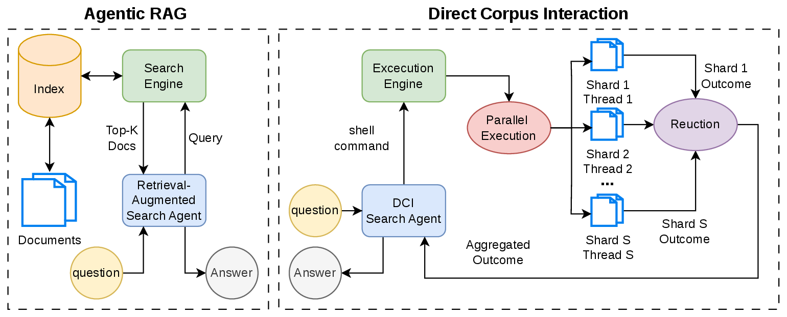

# GrepSeek: Training Search Agents for Direct Corpus Interaction

[](https://github.com/alirezasalemi7/grepseek)
[](https://huggingface.co/alireza7)
[](https://huggingface.co/datasets/alireza7/GrepSeek-ColdStart-SFT-10k)
[](LICENSE)

**GrepSeek** trains a compact open-weight LLM (Qwen3.5-9B) to answer
knowledge-intensive questions by **searching a raw text corpus with Unix shell
commands** (`rg`, `grep`, `head`, …) — *Direct Corpus Interaction (DCI)* — instead
of retrieving from a pre-computed dense or sparse index. Coupling retrieval and
reasoning in one policy gives exact lexical control (great for entity
disambiguation and multi-hop reasoning), needs **no embedding index** (just the
~14 GB raw corpus), and — with our **semantics-preserving sharded-parallel
execution engine** — runs corpus search up to **7.6× faster** while staying
**byte-exact** with plain `grep`.

<p align="center"></p>

## Highlights

- **Two-stage training.** A cold-start SFT dataset built by an *Answer-Aware
  Tutor + Answer-Blind Planner* pipeline (causally-consistent, leakage-free search
  trajectories), then **GRPO** with a token-F1 × format-gate reward.
- **Best overall accuracy.** Highest micro-average **F1 0.5691 / EM 0.4948** over
  7 QA benchmarks, beating strong RL-trained dense/sparse retrieval agents.
- **Index-free & cheap to stand up.** 14 GB RAM (the raw corpus) vs. 70 GB (E5) /
  221 GB (Qwen3-4B-Emb); ~1 min setup vs. 3.2 / 62.4 A100-hours of offline indexing.
- **Full, runnable release.** Cold-start data generation, SFT, RL (GRPO), and the
  inference harness + fast execution engine — all reproducible end-to-end.

## Results (token-level F1)

Trained only on NQ + HotpotQA (marked \*); the other five datasets are
out-of-distribution. GrepSeek wins 4/7 and the best micro-average.

| Method | NQ\* | TriviaQA | PopQA | HotpotQA\* | 2Wiki | MuSiQue | Bamboogle | **micro-avg** |
|---|---|---|---|---|---|---|---|---|
| Search-R1 (Qwen3-4B-Emb, best baseline) | 0.5067 | **0.7693** | **0.5101** | 0.5591 | 0.4299 | 0.2878 | **0.6989** | 0.5441 |
| **GrepSeek** | **0.5223** | 0.7673 | 0.4861 | **0.6231** | **0.5178** | **0.3006** | 0.6212 | **0.5691** |

(EM table and full baselines in the paper.)

## Released artifacts

| | HuggingFace |
|---|---|
| RL model (final GrepSeek) | [`alireza7/GrepSeek-Qwen3.5-9B-GRPO`](https://huggingface.co/alireza7/GrepSeek-Qwen3.5-9B-GRPO) |
| Cold-start SFT model | [`alireza7/GrepSeek-Qwen3.5-9B-SFT`](https://huggingface.co/alireza7/GrepSeek-Qwen3.5-9B-SFT) |
| Cold-start SFT dataset (10k) | [`alireza7/GrepSeek-ColdStart-SFT-10k`](https://huggingface.co/datasets/alireza7/GrepSeek-ColdStart-SFT-10k) |
| Corpus (2018 Wikipedia, 21M passages) | [`PeterJinGo/wiki-18-corpus`](https://huggingface.co/datasets/PeterJinGo/wiki-18-corpus) |

## Repository layout

```
grepseek/
├── cold_start_sft/   # generate the cold-start SFT data (Tutor+Planner) + download the corpus
├── sft/              # supervised fine-tuning of the base model (verl FSDP)
├── rl/               # GRPO training + serving + checkpoint merge  (the `grepseek` package)
├── inference/        # the agent harness (generation + eval) + the fast parallel-search engine
├── verl/             # vendored training engine (Apache-2.0; see verl/VENDORED.md)
├── TRAINING_ENV.md   # exact, verified environment recipe (CUDA 12.8 / torch 2.10 / vLLM 0.17 / …)
└── examples/         # sample questions for the inference quickstart
```
Each stage has its own README: [cold_start_sft](cold_start_sft), [sft](sft),
[rl](rl), [inference](inference).

## Installation

```bash
git clone https://github.com/alirezasalemi7/grepseek && cd grepseek
```
Set up the training/inference environment from the **exact, verified recipe** in
[`TRAINING_ENV.md`](TRAINING_ENV.md) (conda CUDA 12.8 toolkit → torch 2.10 cu128 →
flash-attn → vLLM 0.17 → verl via `PYTHONPATH`). The lightweight data-generation
stage has its own smaller env — see [cold_start_sft/README.md](cold_start_sft/README.md).

Download the corpus once (≈14 GB; verified byte-identical to the paper's):
```bash
python cold_start_sft/download_corpus.py --out_dir data/wiki_18_corpus
```

## Quickstart — run the released model (no training)

Serve the final checkpoint and ask it questions. Models load straight from the
Hub (add `HF_TOKEN=...` if the repo is private).

```bash
# 1. serve GrepSeek (1–2 A100s; vLLM, OpenAI-compatible, Qwen3 tool calling)
MODEL_PATH=alireza7/GrepSeek-Qwen3.5-9B-GRPO bash rl/serve_rl.sh         # -> http://localhost:10730/v1

# 2a. generation on your own questions
GREPSEEK_CORPUS_ROOT=data/wiki_18_corpus \
  bash inference/run_inference.sh --base_url http://localhost:10730/v1 \
    --model grepseek --temperature 0.6 --input examples/questions.jsonl --out_dir output/gen

# 2b. reproduce the benchmark eval (token-F1 / EM on the 7-dataset suite)
GREPSEEK_CORPUS_ROOT=data/wiki_18_corpus \
  bash inference/run_inference.sh --base_url http://localhost:10730/v1 \
    --model grepseek --temperature 0.6 --datasets all --out_dir output/eval
```
Add the **fast execution engine** (sharded parallel grep / daemon) for a large
speedup — see [inference/README.md](inference/README.md).

## Reproduce the full pipeline from scratch

```bash
# 1. Cold-start SFT data — Answer-Aware Tutor + Answer-Blind Planner (serve a Qwen3.5-27B teacher first)
#    -> see cold_start_sft/README.md ; or skip and use the released dataset.
cd cold_start_sft && python create_data.py ... && python to_parquet.py ...     # details in its README

# 2. Supervised fine-tuning (4×A100-80GB)
#    -> sft/README.md
TRAIN_PARQUET=.../train.parquet MODEL_PATH=Qwen/Qwen3.5-9B NPROC=4 bash sft/run_sft.sh
python -m verl.model_merger merge --backend fsdp --local_dir <ckpt>/global_step_N --target_dir <ckpt>/hf

# 3. RL with GRPO (4×A100-80GB), initialized from the SFT checkpoint
#    -> rl/README.md
python rl/prepare_rl_data.py --out_dir data/rl/nq_hotpot          # NQ + HotpotQA
GREPSEEK_MODEL_PATH=<sft_hf> GREPSEEK_TRAIN_FILES=data/rl/nq_hotpot/train.jsonl \
GREPSEEK_VAL_FILES=data/rl/nq_hotpot/dev.jsonl GREPSEEK_CORPUS_ROOT=data/wiki_18_corpus \
NPROC=4 bash rl/run_rl.sh
bash rl/convert_to_hf.sh CKPT_DIR=<rl_ckpt>/global_step_200       # merge for serving

# 4. Evaluate — see Quickstart step 2b.
```
Everything runs on any machine with the right GPUs — **no cluster/scheduler
required**. Each stage's README has the exact knobs and hyperparameters.

## Citation

```bibtex
@article{salemi2026grepseek,
  title  = {GrepSeek: Training Search Agents for Direct Corpus Interaction},
  author = {Salemi, Alireza and Zeng, Chang and Nijasure, Atharva and
            Chung, Jui-Hui and Rahimi, Negin and Diaz, Fernando and Zamani, Hamed},
  year   = {2026}
}
```

## License & acknowledgements

Code is released under the [Apache-2.0](LICENSE) license. The model weights derive
from `Qwen/Qwen3.5-9B` and are subject to its license. Training uses a vendored
copy of [verl](https://github.com/volcengine/verl) (Apache-2.0; see
[verl/VENDORED.md](verl/VENDORED.md)). Benchmarks are from the
[FlashRAG](https://huggingface.co/datasets/RUC-NLPIR/FlashRAG_datasets) suite and
the corpus from [`PeterJinGo/wiki-18-corpus`](https://huggingface.co/datasets/PeterJinGo/wiki-18-corpus).
